<p align="center">
  
  
  
  
  
</p>

# 💰 RD Management System – Full Stack Web Application

A complete **Recurring Deposit (RD) Management System** built using  
**Spring Boot (Backend)** and **React + Vite (Frontend)**.

This application simulates a real-world banking RD workflow where **users can open RD accounts, pay monthly installments, apply for loans, and claim maturity**, while **admins manage approvals, payouts, and closures**.

---

## 📸 Visual Overview (Project Screenshots)

### 👤 User Module

| Feature | Preview |
|------|------|
| User Registration | 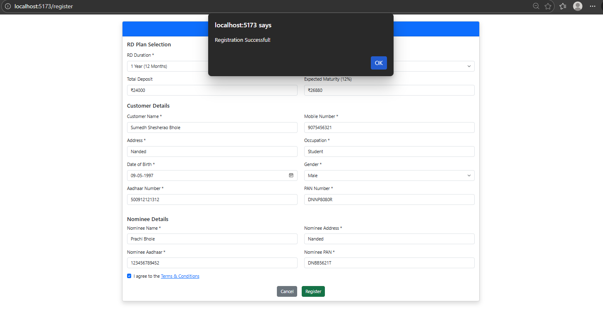 |
| User Login | 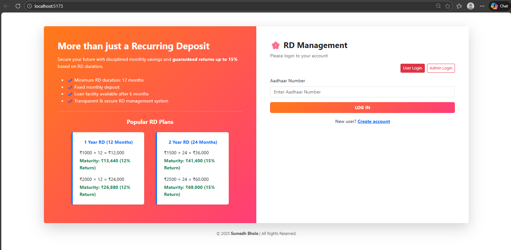 |
| User Dashboard | 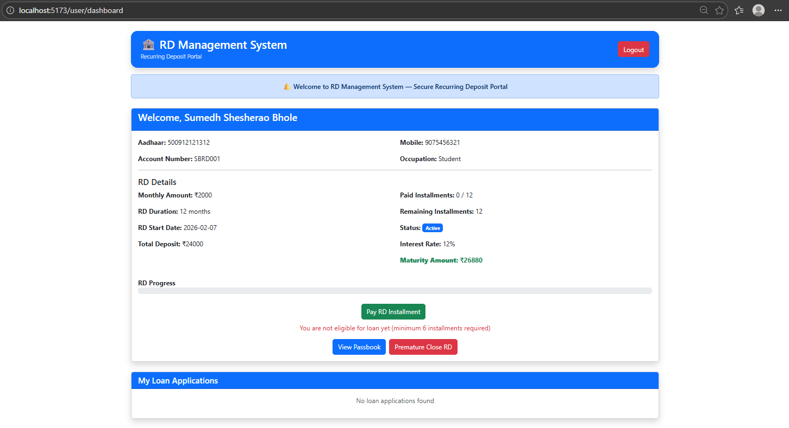 |
| Apply RD / Loan | 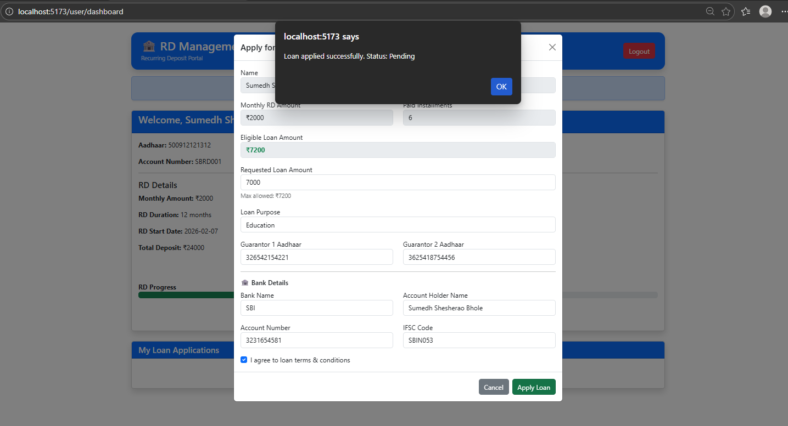 |
| Pay RD Installment |  |
| RD Installments | 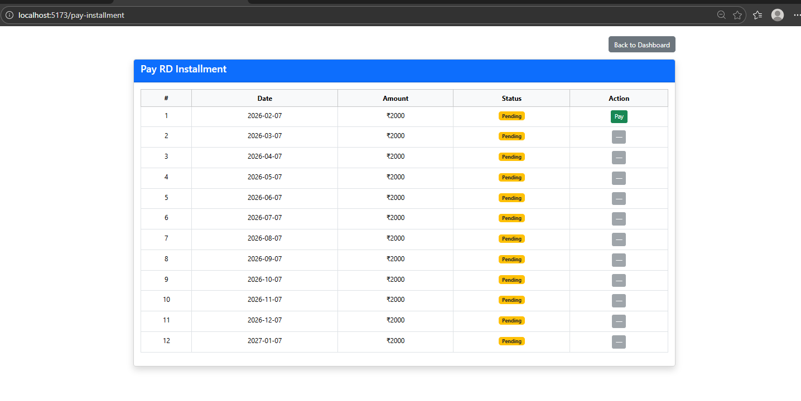 |
| Passbook View | 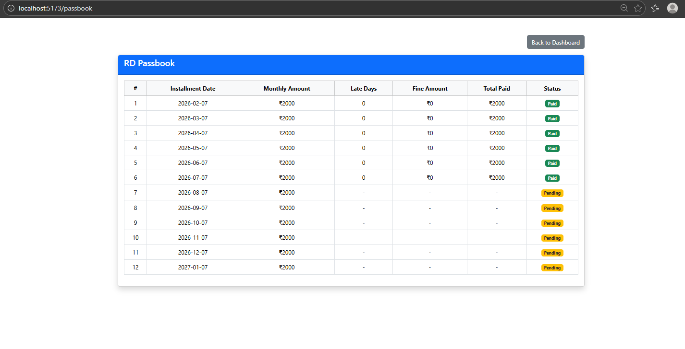 |
| EMI Approval | 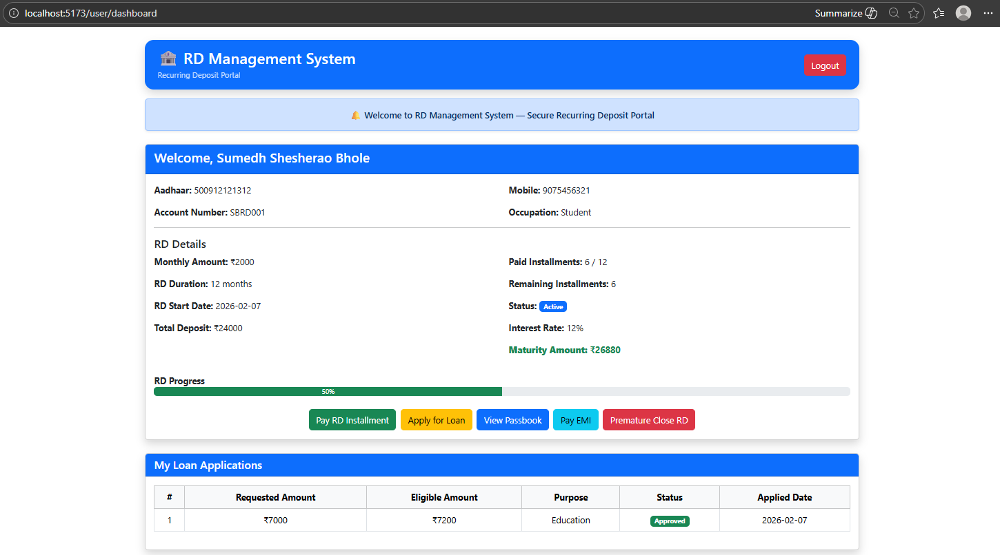 |
| Maturity Button | 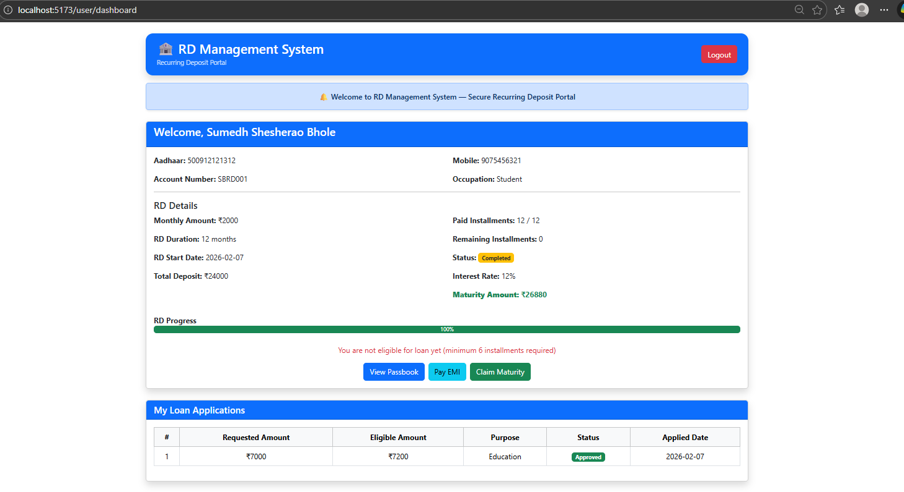 |
| Claim Maturity | 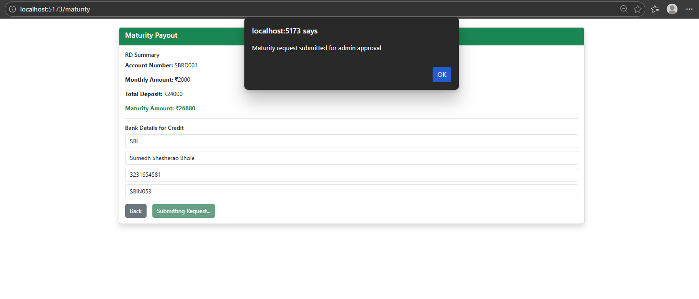 |
| Pre-Maturity RD Close | 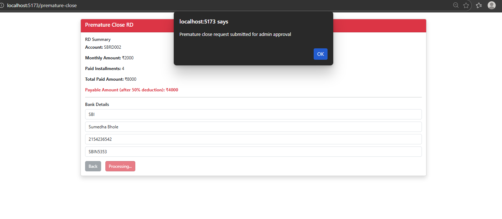 |

---

### 🛠 Admin Module

| Feature | Preview |
|------|------|
| Admin Login |  |
| Admin Dashboard | 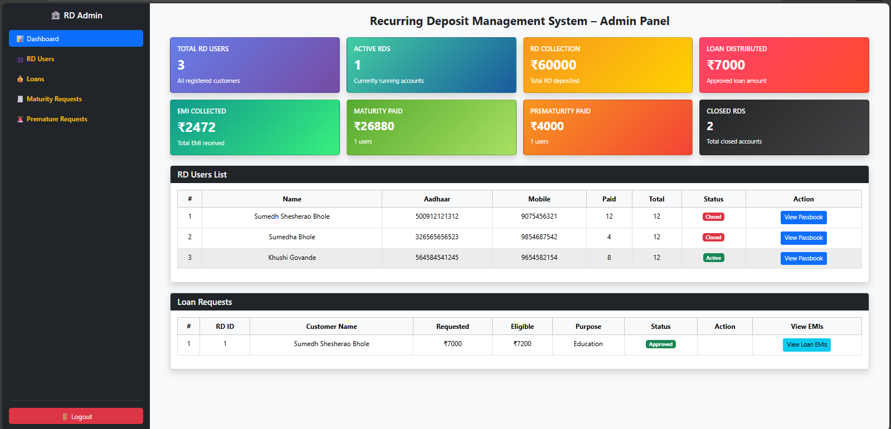 |
| Loan Approval | 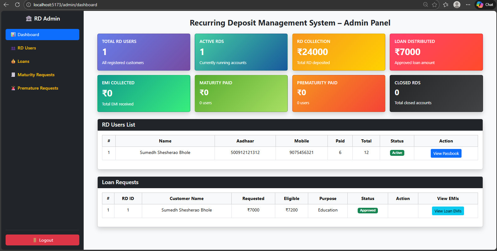 |
| Maturity Requests | 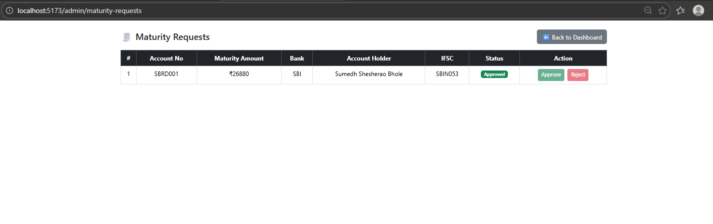 |
| Pre-Maturity Approval | 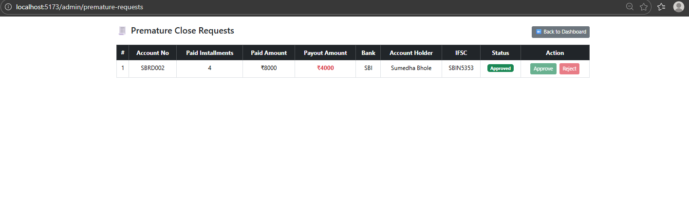 |

---

## 🛠 Technical Stack

### Frontend
- React.js (Vite)
- JavaScript, HTML5, CSS3
- Bootstrap

### Backend
- Spring Boot
- Spring Data JPA
- RESTful APIs

### Database
- PostgreSQL

### Tools
- Spring Tool Suite (STS)
- VS Code
- Git & GitHub
- Postman

---

## 🚀 Core Features

### User Features
- Secure user registration & login
- RD account creation
- Monthly RD installment payment
- Loan application against RD
- View RD passbook & installment history
- Claim maturity amount
- Pre-maturity RD closure

### Admin Features
- Admin authentication
- Approve / reject RD loans
- Approve EMI payments
- Manage maturity requests
- Handle pre-maturity RD closures

---

## ⚙️ Installation & Setup (Localhost)

### Backend Setup (Spring Boot)
- Open `rd-system-backend` in **Spring Tool Suite**
- Configure PostgreSQL in `application.properties`
- Create database in PostgreSQL
- Run Spring Boot application

### Frontend Setup (React + Vite)

```bash
cd rd-system-frontend
npm install
npm run dev

```

Frontend runs on:

http://localhost:5173
---

## 📂 Project Structure

```
RD-Management-System
├── rd-system-backend
├── rd-system-frontend
├── rd-project-screenshots
└── README.md
```

---

## 👨‍💻 Author

**Sumedh Bhole**  
GitHub: https://github.com/sumedhbhole

---

⭐ If you like this project, don’t forget to give it a star!

<p align="center">  </p>
